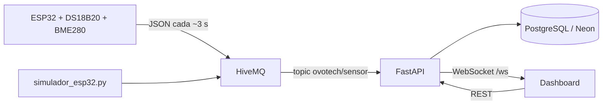

# OVOTECH — Incubadora inteligente (IoT)

Sistema de monitoreo en tiempo real de **temperatura** y **humedad** para incubadoras de huevos. Los datos salen de un **ESP32** con **sonda DS18B20** (temperatura) y **BME280** (humedad), viajan por **MQTT**, se persisten en **PostgreSQL** y se muestran en un **dashboard web** con gráficos y alertas por rangos.

---

## Arquitectura



| Componente | Tecnología | Rol |
|------------|------------|-----|
| Hardware | ESP32, DS18B20, BME280, Arduino | Lee sensores, WiFi, publica MQTT |
| Mensajería | HiveMQ (broker público) | Canal entre dispositivos y API |
| Backend | FastAPI, Uvicorn, SQLAlchemy | Recibe MQTT, guarda datos, WebSocket |
| Base de datos | PostgreSQL (Neon) | Histórico y vinculaciones |
| Frontend | HTML, CSS, JS, Chart.js | Panel en Netlify o `/static` |
| Hosting API | [Render](https://render.com) | `https://ovotech.onrender.com` |
| Hosting web | [Netlify](https://netlify.com) | `https://ovo-tech.netlify.app` |

---

## Estructura del proyecto

```
.
├── main.py                 # API FastAPI, procesador MQTT, endpoints
├── mqtt_client.py          # Cliente Paho MQTT
├── websocket_manager.py    # Conexiones WebSocket en vivo
├── database.py             # Conexión SQLAlchemy + sesión
├── models.py               # Tablas lecturas y vinculaciones
├── schemas.py              # Modelos Pydantic de respuesta
├── simulador_esp32.py      # Simula un ESP32 sin hardware
├── test_bdd.py             # Prueba de conexión a la base de datos
├── ovotech_esp32.ino       # Firmware para ESP32
├── requirements.txt
├── .env.example            # Plantilla de variables de entorno
└── static/
    ├── index.html          # Landing / presentación
    ├── presentacion.html   # Dashboard (vinculación + gráficos)
    ├── script.js           # Lógica del panel (API + WebSocket)
    ├── style.css
    └── presentacion.css
```

---

## Requisitos

- **Python** 3.10 o superior  
- **PostgreSQL** (recomendado: [Neon](https://neon.tech) — plan gratuito)  
- Para hardware: **ESP32**, **sonda DS18B20**, módulo **BME280** (I2C), Arduino IDE con librerías indicadas en la sección firmware  
- Opcional: cuenta en **Render** (API) y **Netlify** (frontend estático)

---

## Instalación local

### 1. Clonar e instalar dependencias

```bash
git clone <url-del-repositorio>
cd "PROCESO PROYECTO"

python -m venv venv

# Windows
venv\Scripts\activate

# Linux / macOS
source venv/bin/activate

pip install -r requirements.txt
```

### 2. Configurar variables de entorno

```bash
# Windows
copy .env.example .env

# Linux / macOS
cp .env.example .env
```

Editá `.env` y completá al menos `DATABASE_URL`. Ver [`.env.example`](.env.example) para el detalle de cada variable.

### 3. Probar la base de datos

```bash
python test_bdd.py
```

Deberías ver un mensaje de conexión exitosa a PostgreSQL.

### 4. Iniciar la API

```bash
python main.py
```

La API queda en `http://localhost:8000`.

- Documentación interactiva: `http://localhost:8000/docs`  
- Landing: `http://localhost:8000/static/index.html`  
- Dashboard: `http://localhost:8000/static/presentacion.html`  

---

## Simular un dispositivo (sin ESP32)

Con la API en marcha, en otra terminal:

```bash
python simulador_esp32.py incubadora_demo
```

Publica cada 3 segundos temperatura y humedad aleatorias al topic MQTT. El `device_id` es el argumento (`incubadora_demo` en el ejemplo).

Luego en el dashboard ingresá ese mismo ID para vincular. **Importante:** la incubadora debe haber enviado al menos una lectura antes de vincular; si no, la API responde 404.

---

## Firmware ESP32

Sensores usados:

| Sensor | Función | Conexión |
|--------|---------|----------|
| **DS18B20** | Temperatura (sonda) | 1-Wire en GPIO **4** (DATA), VCC 3.3V, GND, pull-up **4.7 kΩ** entre DATA y 3.3V |
| **BME280** | Humedad | I2C: **SDA → GPIO 21**, **SCL → GPIO 22**, VCC 3.3V, GND |

1. Abrí `ovotech_esp32.ino` en Arduino IDE.  
2. Instalá las librerías (Gestor de librerías):
   - **PubSubClient**
   - **ArduinoJson**
   - **Adafruit BME280 Library** (instala también **Adafruit Unified Sensor** si te lo pide)
   - **OneWire**
   - **DallasTemperature**
3. Si el BME280 no inicia, cambiá `BME280_ADDRESS` de `0x76` a `0x77` en el `.ino`.  
4. Flasheá el ESP32 y abrí el monitor serie a **115200** baud.

### Primer arranque (WiFi)

Si no hay credenciales guardadas, el ESP32 crea un punto de acceso:

- **Red:** `OVOTECH-XXXXXX` (sufijo derivado del ID)  
- **Contraseña AP:** `12345678` (configurable en el `.ino`)  
- Abrí en el celular la IP que muestra el monitor serie (p. ej. `http://192.168.4.1`) y cargá SSID y contraseña de tu WiFi.

### ID del dispositivo

El ID es **permanente** y se genera desde la MAC:

```
ovotech-A4CF12
```

Ese valor aparece en el portal de configuración y debés usarlo en el dashboard para vincular.

### Payload MQTT (formato esperado por la API)

```json
{
  "temperatura": 37.5,
  "humedad": 62.3,
  "device_id": "ovotech-A4CF12"
}
```

Topic por defecto: `ovotech/sensor` — debe coincidir con `MQTT_TOPIC` en `.env` y en el firmware.

---

## API REST

| Método | Ruta | Descripción |
|--------|------|-------------|
| `GET` | `/` | Estado de la API |
| `POST` | `/api/vincular` | Vincula un `device_id` (requiere lecturas previas) |
| `GET` | `/api/mis-dispositivos` | Lista vinculaciones registradas |
| `GET` | `/api/lecturas?limit=50` | Últimas lecturas (todos los dispositivos) |
| `GET` | `/api/lecturas/{device_id}?limit=50` | Histórico de una incubadora |
| `GET` | `/api/lecturas/ultima/{device_id}` | Última lectura de un dispositivo |
| `WS` | `/ws` | Lecturas en tiempo real (`type: "lectura"`) |

Ejemplo de vinculación:

```bash
curl -X POST http://localhost:8000/api/vincular \
  -H "Content-Type: application/json" \
  -d "{\"device_id\": \"incubadora_demo\", \"nombre_usuario\": null}"
```

---

## Dashboard web

1. **Vinculación:** el usuario ingresa el `device_id`; se guarda en `localStorage` (`ovotech_device_id`).  
2. **Histórico:** carga vía `GET /api/lecturas/{device_id}`.  
3. **Tiempo real:** WebSocket en `/ws`; el cliente filtra mensajes por su `device_id`.  
4. **Estados:** temperatura y humedad con rangos Óptimo / Advertencia / Peligro (umbrales orientados a incubación).

### URLs en producción

El frontend en Netlify apunta automáticamente a Render cuando no está en `localhost` (ver `static/script.js`):

- API: `https://ovotech.onrender.com`  
- WebSocket: `wss://ovotech.onrender.com/ws`  

Para desarrollo local, abrí el HTML desde el mismo backend (`http://localhost:8000/static/...`) o configurá un servidor estático en el puerto 5500 (incluido en CORS).

---

## Despliegue en producción

### Base de datos (Neon)

1. Creá un proyecto en Neon.  
2. Copiá la connection string y configurá `DATABASE_URL` en Render (y en tu `.env` local si querés usar la misma BD).

### API (Render)

1. Nuevo **Web Service**, repositorio conectado a Git.  
2. **Build:** `pip install -r requirements.txt`  
3. **Start:** `uvicorn main:app --host 0.0.0.0 --port $PORT`  
4. Variables de entorno en el panel de Render:
   - `DATABASE_URL` (obligatorio)
   - `MQTT_BROKER`, `MQTT_PORT`, `MQTT_TOPIC` (opcional)
   - `PORT` lo define Render automáticamente  

Las tablas se crean al arrancar (`Base.metadata.create_all`).

### Frontend (Netlify)

1. Sitio estático apuntando a la carpeta `static/` (o el repo con publish directory `static`).  
2. Si cambiás la URL de Render, actualizá `RENDER_URL` y `WS_URL` en `static/script.js`.  
3. Si usás otro dominio, agregalo en `origins` dentro de `main.py` (CORS).

---

## Variables de entorno

| Variable | Obligatoria | Por defecto | Descripción |
|----------|-------------|-------------|-------------|
| `DATABASE_URL` | Sí | — | URL PostgreSQL (Neon u otro) |
| `PORT` | No | `8000` | Puerto del servidor |
| `MQTT_BROKER` | No | `broker.hivemq.com` | Broker MQTT |
| `MQTT_PORT` | No | `1883` | Puerto MQTT |
| `MQTT_TOPIC` | No | `ovotech/sensor` | Topic de suscripción |

Plantilla completa: [`.env.example`](.env.example).

---

## Comportamiento de datos

- Se guardan **temperatura**, **humedad**, **device_id** y **timestamp** por lectura.  
- Rotación automática: se conservan como máximo **50 lecturas por dispositivo**; las más antiguas se eliminan.  
- La vinculación en servidor exige que el `device_id` ya haya enviado al menos un dato (evita IDs inventados sin hardware).

---

## Solución de problemas

| Problema | Qué revisar |
|----------|-------------|
| `DATABASE_URL no está configurada` | Existe `.env` con `DATABASE_URL` válida |
| Error al vincular (404) | El simulador o ESP32 ya publicó al menos una lectura |
| Dashboard sin datos en vivo | API corriendo, MQTT conectado (logs `✅ Conectado a HiveMQ`), mismo `device_id` |
| WebSocket desconectado en Render | Plan free puede “dormir” el servicio; esperá ~30 s y recargá |
| CORS bloqueado | Tu origen debe estar en `origins` de `main.py` |
| Error DS18B20 | DATA en GPIO 4, pull-up 4.7k, sonda bien alimentada (3.3V) |
| Error BME280 | SDA/SCL en 21/22, dirección I2C 0x76 u 0x77 |

---

## Licencia y autor

Proyecto **OVOTECH** — monitoreo IoT para incubación.  
Ajustá licencia y créditos del equipo según corresponda a tu entrega académica o producto.
